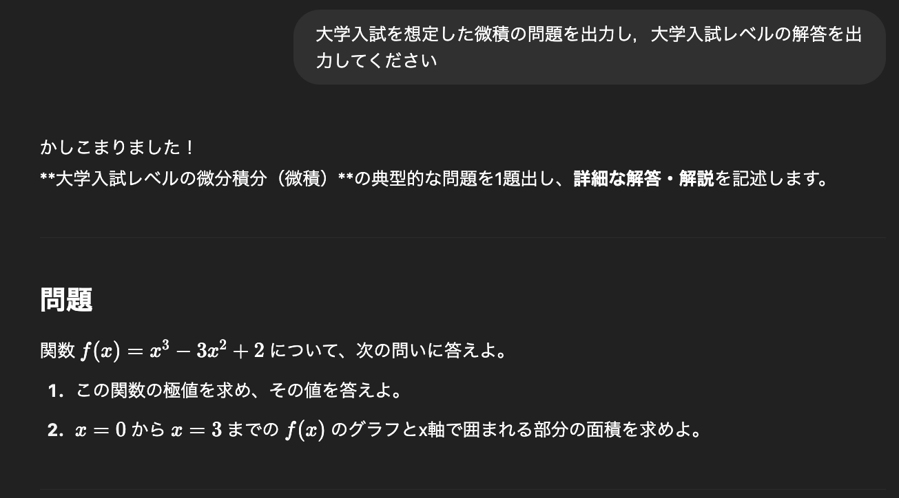
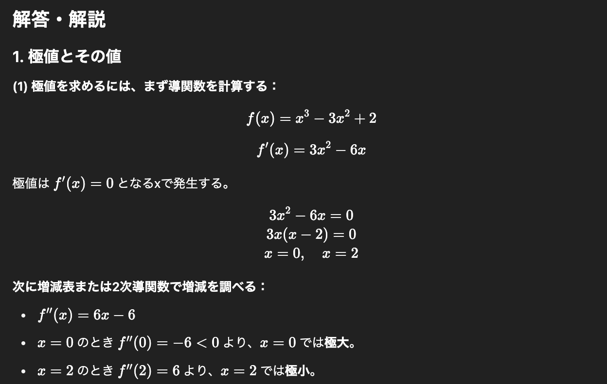
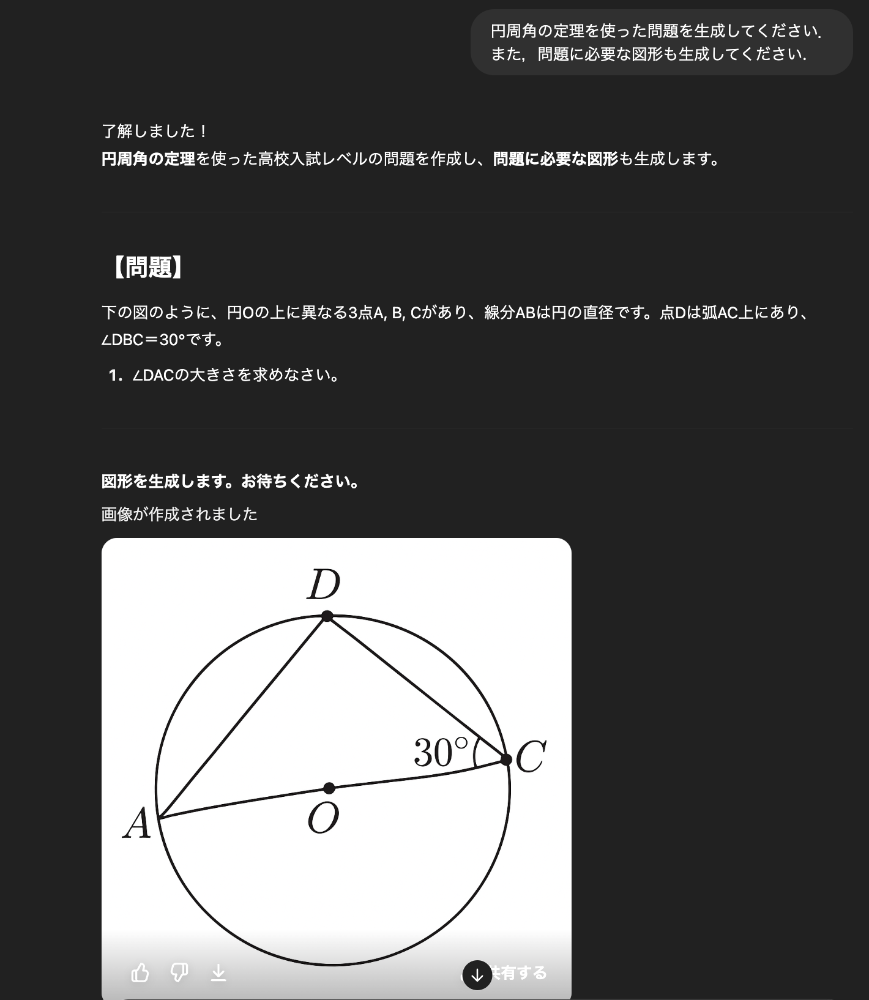
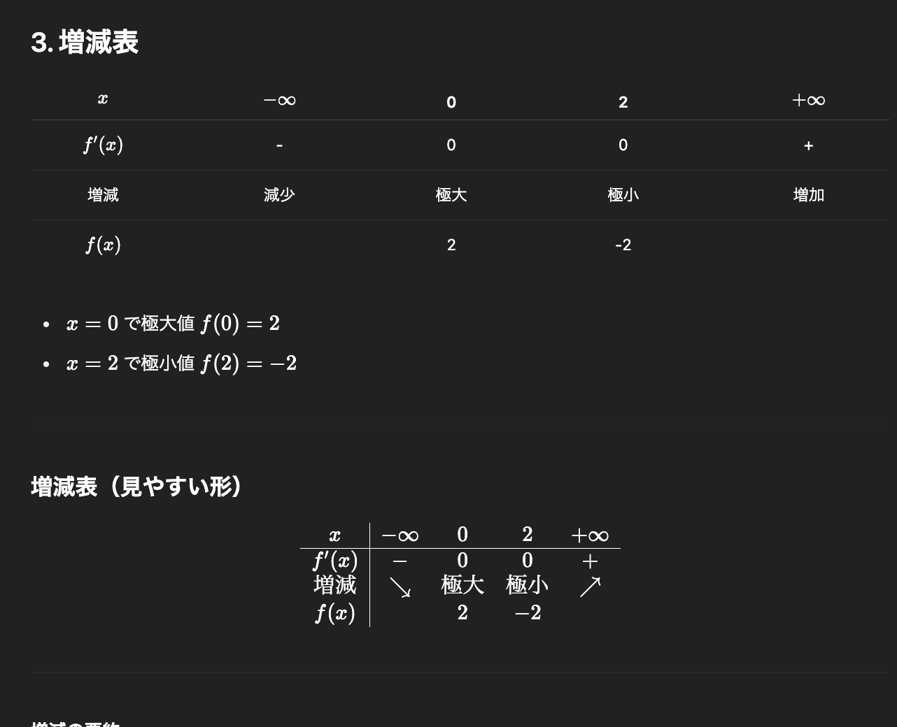

# 新規問題作成AI「問ジェネ」
## 高校入試対策の革新的ソリューション

---

## 📖 　今日お話しすること

## 1️⃣ 　塾の現場で起きている問題
## 2️⃣ 　AIで解決できること  
## 3️⃣ 　実際に作ってみた結果
## 4️⃣　ビジネスとしての可能性

---

## 😰 　塾講師の悩み

📚
<strong>過去問が足りない！</strong> 販売されているのは約10年分だけ

😵
<strong>生徒がやり尽くしてしまう</strong> 新しい問題がもうない...

⏰
<strong>問題作成に時間がかかる</strong> 質の高い問題を作るのは大変

---

## 💡 　もしも...

∞

無限に問題が作れたら？

⬇️

🤖
<strong>AIが問題を自動生成</strong>

---

## 🎯 　解決策：AI問題生成システム

📖
<strong>過去問を学習</strong> 各高校の傾向を分析

⚡
<strong>瞬時に問題生成</strong> 必要な分だけ作成可能

🖨️
<strong>PDF出力対応</strong> 紙に印刷してすぐ使える

---

## 🧪 　実際に試してみました

ChatGPTで数学問題を生成

⬇️

結果をお見せします！

---

## 📊 　実験結果 ①：微分問題

✅
高校レベルの適切な問題が生成された

---

## 📊 　実験結果 ②：解答付き問題

✅
詳しい解答プロセスも自動生成

---

## 📊 　実験結果 ③：演習問題

✅
実際の授業で使えるレベル

---

## 📊 　実験結果 ④：増減表問題

✅
複雑な問題形式にも対応

---

## 🎉 　実験で分かったこと

👍

🎯
<strong>技術的に実現可能！</strong>

📝
数学的に正確な問題

📚
解答プロセスも論理的

🎓
高校入試レベルに適合

---

## 🏢 　誰に売る？

塾講師の皆さん

🏫
NSG教育研究会

🌲
森塾

⭐
TOP

🌟
Polaris長岡

---

## 💰 　どうやって稼ぐ？

💼
<strong>月額サービス</strong> 塾向けの問題生成サービス

💾
<strong>問題ストック機能</strong> 生成した問題を蓄積・再利用

📖
<strong>教材販売</strong> 蓄積した問題で問題集作成

---

## ⚠️ 　課題：お金がかかる

💸
<strong>API料金が高い</strong>

⬇️

💡
<strong>解決策：問題を貯める</strong> 一度作った問題は再利用

---

## ⚠️ 　課題：図が難しい

📐
<strong>図形問題の精度が低い</strong>

⬇️

🤝
<strong>解決策：人間と協力</strong> AIが文章、人間が図を作成

---

## 🚀 　まずは数学から

📊

数学が一番需要がありそう

📈
需要が高い科目

✏️
図は講師が描ける

🎯
問題パターンが豊富

---

## 📈 　期待される効果

🎉

### 塾講師にとって

⏰
時間短縮

📚
無制限の問題供給

### 生徒にとって

💪
豊富な練習機会

🎯
入試対策強化

---

## 🎯 　今後の計画

1️⃣
<strong>数学プロトタイプ完成</strong>

2️⃣
<strong>塾での実証実験</strong>

3️⃣
<strong>他科目への展開</strong>

---

## 💪 　成功の鍵

塾講師 × AIエンジニア

👨‍🏫
現場を知っている

💻
技術力がある

🏠
地域に根ざしている

---

# 🙏 ありがとうございました

❓

ご質問・ご意見をお聞かせください

<strong>新規問題作成AI（BtoB）</strong> 
〜 教育現場の課題をAIで解決 〜

